#### Faculty of Electrical Engineering, Sarajevo
#### Mobile application development 2018/2019

---

RMA - Quiz App is an application for creating and playing quizzes. It can be used by multiple users in parallel and can work in online and offline mode. 

Some relevant features include:
  - Create quiz category
  - Create/Edit quiz
  - Add a quiz question
  - Overview of all present categories, quizzes and questions
  - Import a quiz via CSV file
  - Online/Offline mode
  - Playing the quiz
  - Quiz timer
  - Ranking list
  
The app uses **Cloud Firestore** to store relevant game informations (_online mode_) and **SQLite** (_offline mode_)

You can download the debug APK file at: [Quiz App]

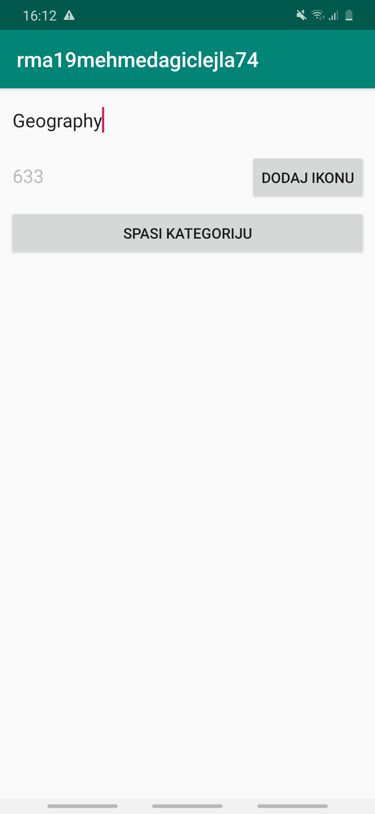 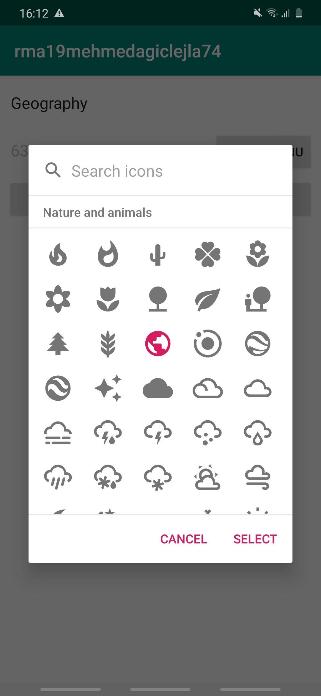 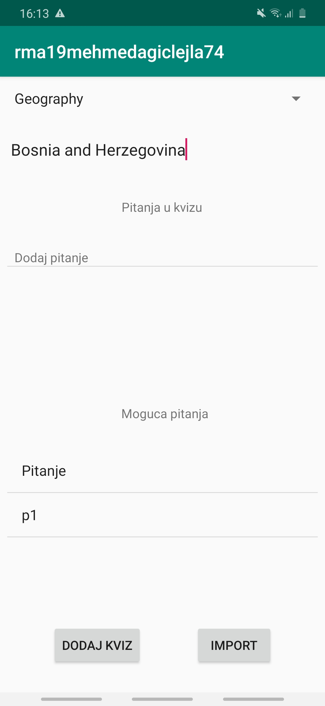

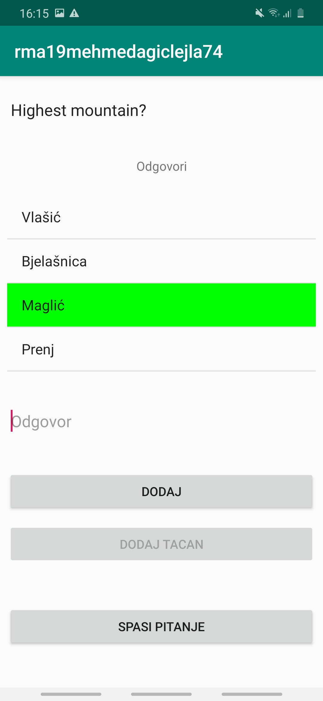 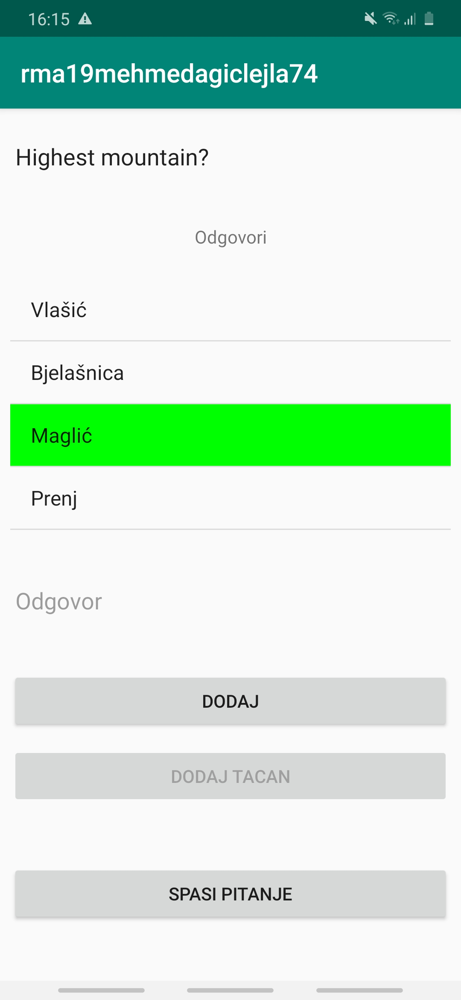 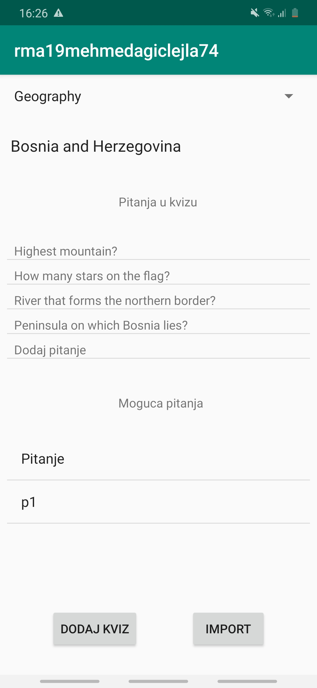

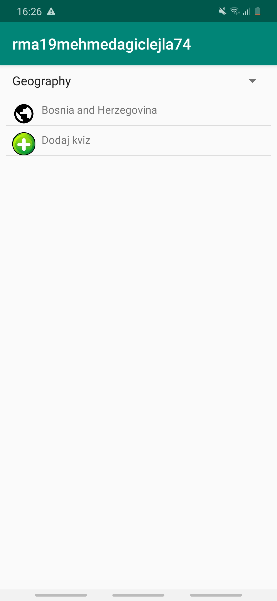 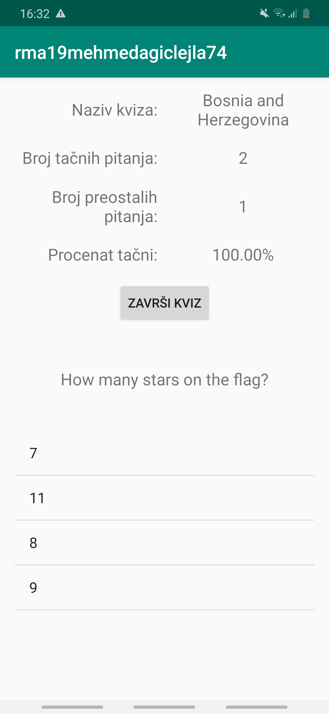 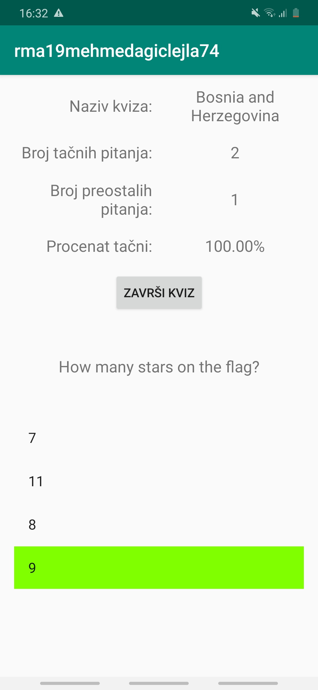

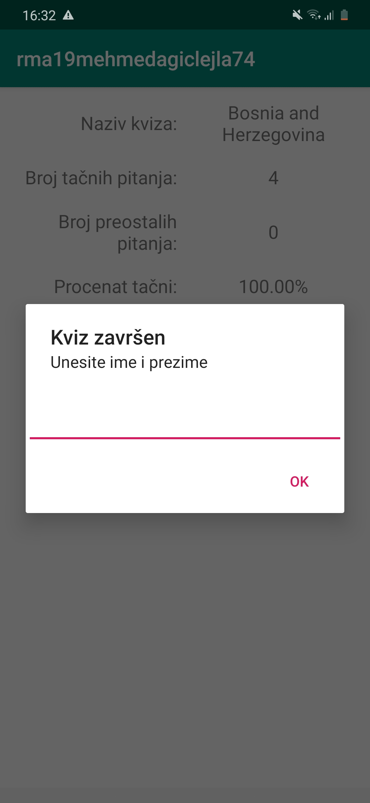 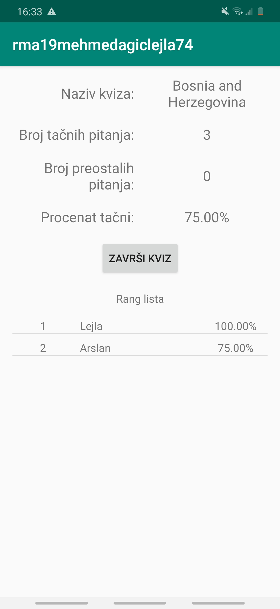 

---

[Quiz App]: https://drive.google.com/file/d/19qMXXnfgeD7gXkZV4hreQwXm9tHHYnm-/view?usp=sharing
